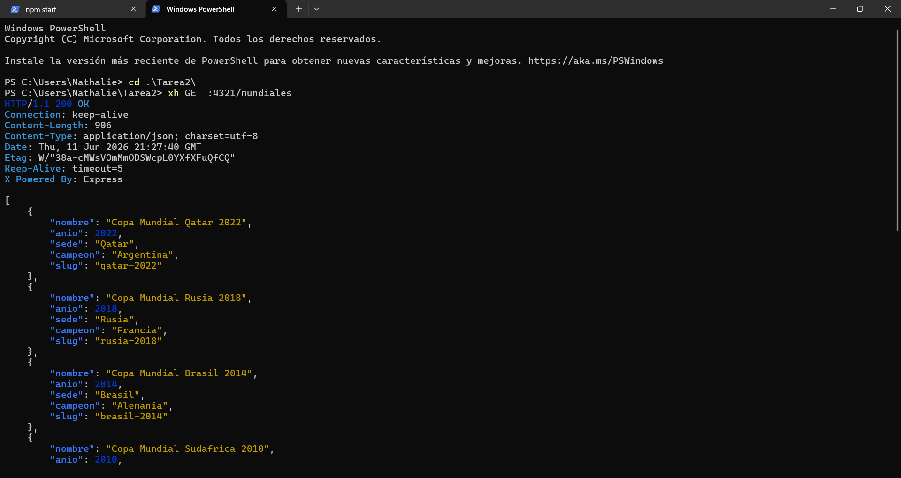
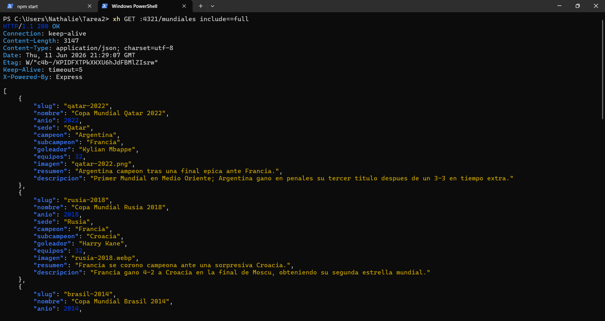
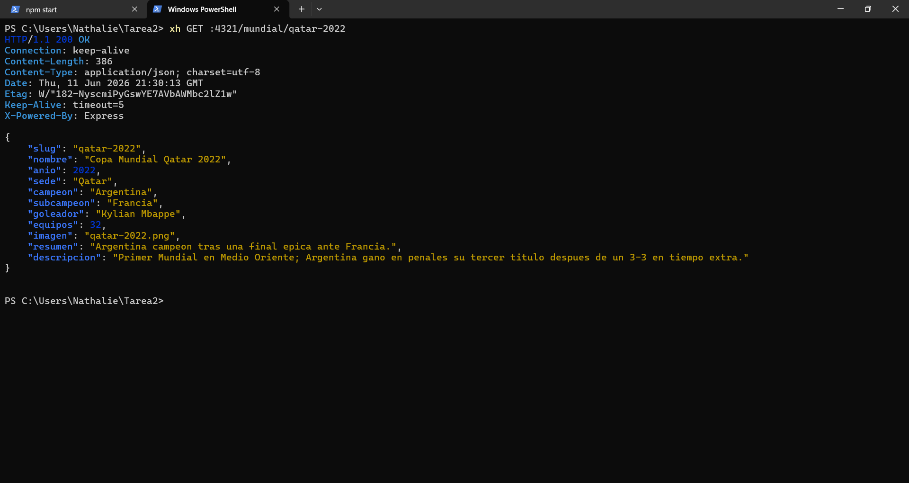
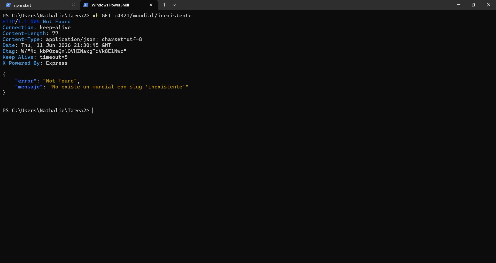
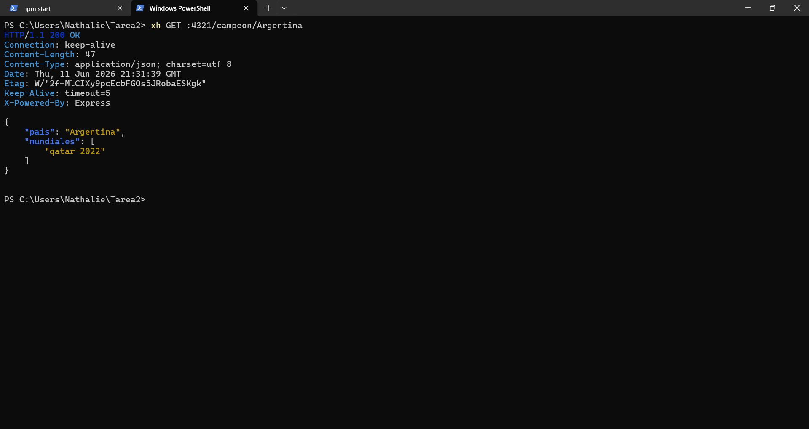
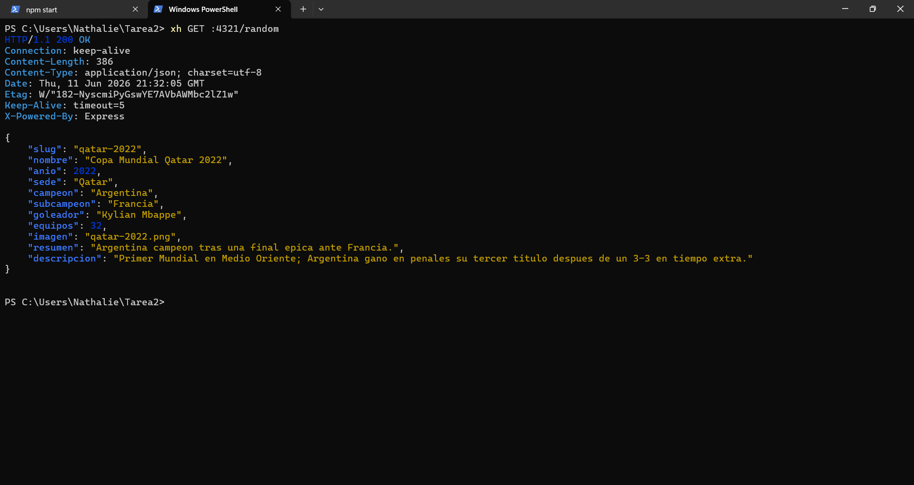
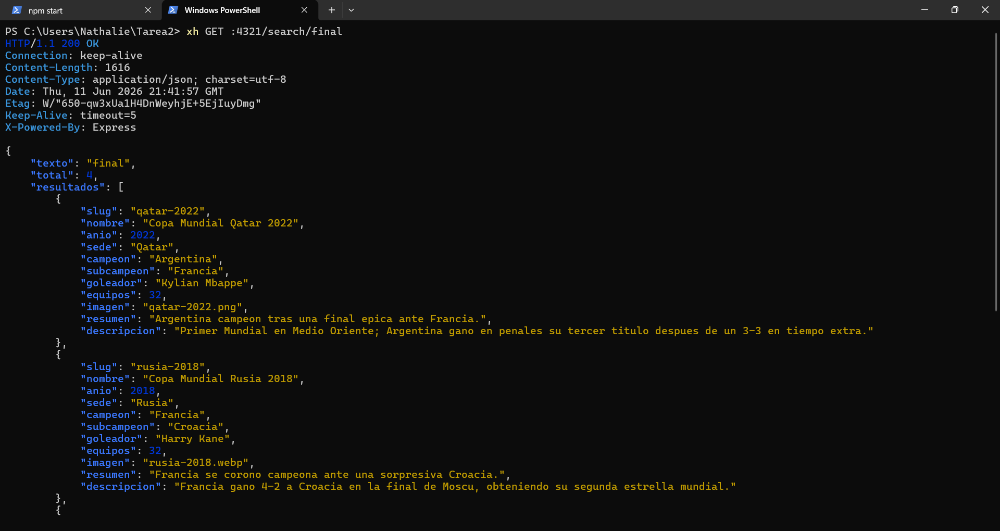
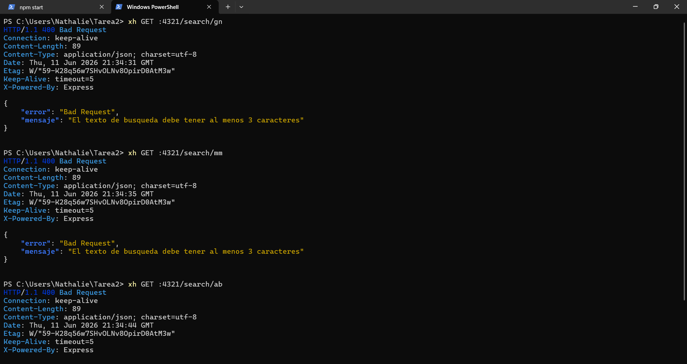

# Capturas de pruebas con xh / httpie

Pruebas documentadas del API. Levanta el servidor con `npm start` antes de ejecutar.

---

## 1. Listar todos los mundiales (resumen)

```bash
xh GET :4321/mundiales
```

**Resultado esperado:** `200 OK` con un arreglo de 8 mundiales (solo `nombre`, `anio`, `sede`, `campeon`, `slug`).



---

## 2. Listar mundiales con todos los campos

```bash
xh GET :4321/mundiales include==full
```

**Resultado esperado:** `200 OK` con los 8 mundiales y todos sus campos (`subcampeon`, `goleador`, `equipos`, `imagen`, `resumen`, `descripcion`).



---

## 3. Detalle por slug

```bash
xh GET :4321/mundial/qatar-2022
```

**Resultado esperado:** `200 OK` con el objeto completo del Mundial Qatar 2022.



---

## 4. Detalle inexistente (404)

```bash
xh GET :4321/mundial/inexistente
```

**Resultado esperado:** `404 Not Found` con JSON `{ error, mensaje }`.



---

## 5. Mundiales ganados por un pais

```bash
xh GET :4321/campeon/Argentina
```

**Resultado esperado:** `200 OK` con `{ pais, mundiales: ["qatar-2022"] }`.



---

## 6. Mundial al azar

```bash
xh GET :4321/random
```

**Resultado esperado:** `200 OK` con un mundial cualquiera (cambia en cada llamada).



---

## 7. Busqueda por texto

```bash
xh GET :4321/search/final
```

**Resultado esperado:** `200 OK` con los mundiales cuyos campos contienen "final".



---

## 8. Busqueda con texto invalido (400)

```bash
xh GET :4321/search/ab
```

**Resultado esperado:** `400 Bad Request` con mensaje de Zod ("minimo 3 caracteres").



---

## 9. Servir imagen

```bash
xh GET :4321/imagenes/qatar-2022.avif
```

**Resultado esperado:** `200 OK` con los bytes de la imagen.


